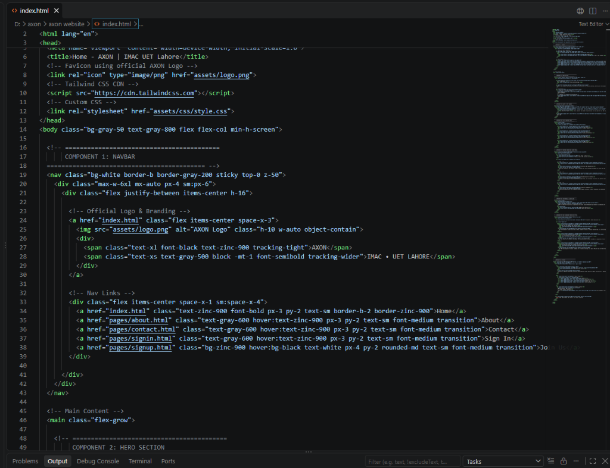
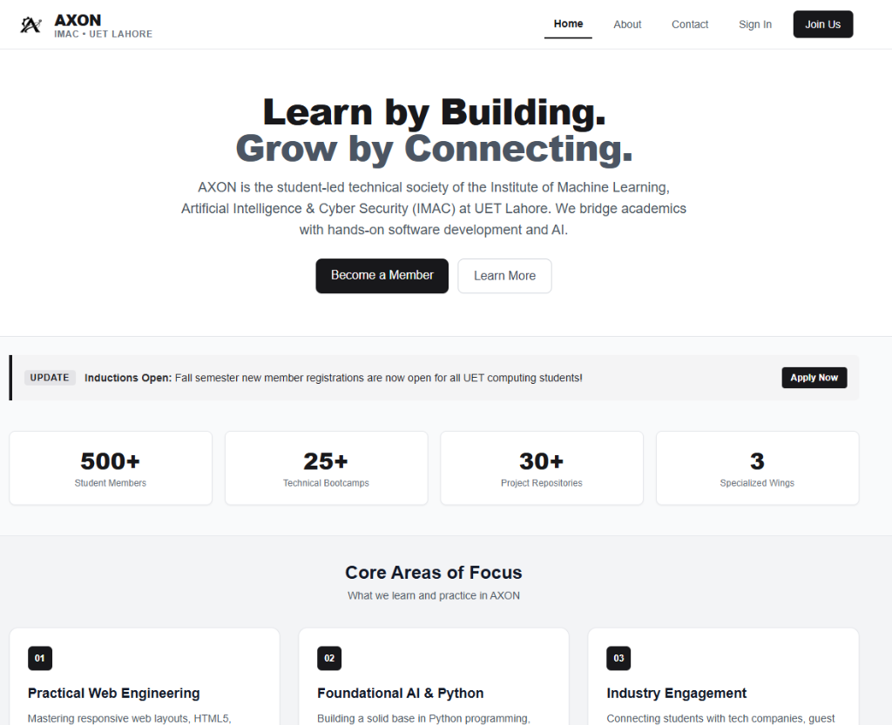
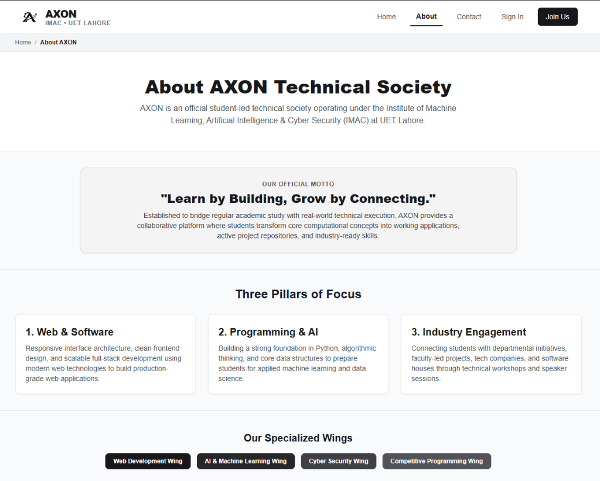
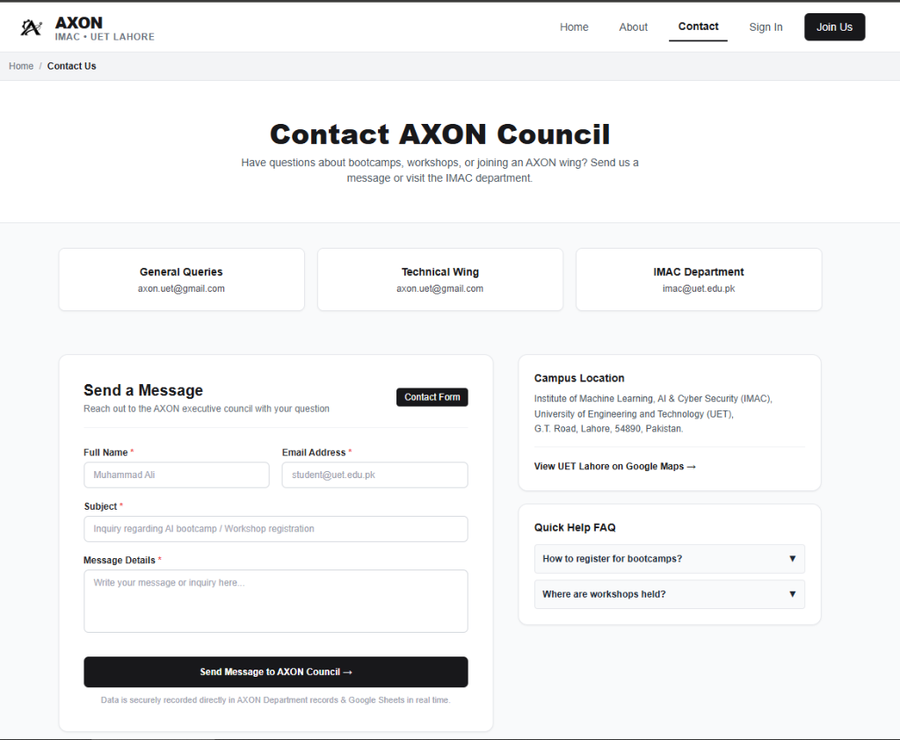
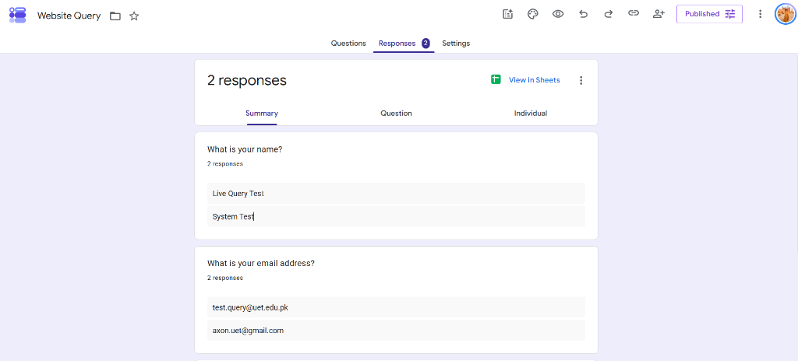

# Web Technologies — Assignment 01 Report
## Multi-Page Website Development Using HTML & Tailwind CSS

---

### Student & Submission Details
* **Student Name:** Afeef Ul Hussain
* **Roll Number / Student ID:** [Insert Your Roll Number, e.g. 2023-CS-XX]
* **Degree Program:** BS Computer Science / Data Science
* **Department:** Institute of Machine Learning, Artificial Intelligence & Cyber Security (IMAC)
* **Institution:** University of Engineering and Technology (UET), Lahore
* **Course:** Web Technologies (CS-311 / WT-01)
* **Assignment Number:** 01 (Multi-Page Website Development)
* **Total Marks:** 30
* **Submission Date:** October 2026

---

### Official Submission Links
* **Live Website URL (GitHub Pages):**  
  [https://afeefulhussain.github.io/axon-website/](https://afeefulhussain.github.io/axon-website/)
* **GitHub Source Code Repository:**  
  [https://github.com/afeefulhussain/axon-website](https://github.com/afeefulhussain/axon-website)

---

## 1. Project Overview & Society Description

**AXON** is an official student-led technical society founded in **2026** at the **Institute of Machine Learning, Artificial Intelligence & Cyber Security (IMAC)**, University of Engineering and Technology (UET) Lahore. 

### Society Motto:
> *"Learn by Building, Grow by Connecting."*

### Core Objectives:
1. **Practical Web & Software Engineering:** Cultivating modern web layout architecture, responsive frontend design, and scalable client-server development using HTML5 and Tailwind CSS.
2. **Core Computational & AI Foundations:** Fostering practical problem-solving in Python, core algorithms, and data modeling for machine learning and cyber security applications.
3. **Departmental & Industry Integration:** Connecting undergraduate students with departmental research initiatives, technical workshops, alumni networks, and software industry leaders.

---

## 2. Technology Stack

* **Markup:** Semantic HTML5 (W3C compliant, accessible form controls, native accordion elements)
* **Styling & Layout:** Tailwind CSS v3 via official CDN, CSS Flexbox, CSS Grid
* **Typography & Smooth Motion:** Custom stylesheet (`assets/css/style.css`) with smooth scroll behavior
* **Client-Side Feedback:** Pure lightweight Vanilla JavaScript (strictly for form UX feedback, modal toggling, and frame targeting — 0% external frameworks or libraries)
* **Backend Processing:** Headless Google Forms API integration with zero page redirects and instant Google Sheets recording
* **Version Control & Hosting:** Git, GitHub, and GitHub Pages

---

## 3. Project Directory Architecture

```text
d:\axon\axon website\
│
├── index.html                      # 1. Home Page
├── README.md                       # Repository Documentation & Setup Guide
├── .gitignore                      # Git configuration to ignore temporary files
│
├── assets\
│   ├── logo.png                    # AXON mechanical gear & AI neural emblem (86 KB)
│   ├── favicon.png                 # Browser tab icon
│   └── css\
│       └── style.css               # Smooth scrolling & foundational font styling
│
└── pages\
    ├── about.html                  # 2. About Us Page (2026 Foundation Roadmap)
    ├── contact.html                # 3. Contact Us Page (Connected to Google Form)
    ├── signin.html                 # 4. Member Sign In Dashboard
    └── signup.html                 # 5. Join Society / Registration (Connected to Google Form)
```

---

## 4. Multi-Page Website Architecture & Features

The project is structured across **5 distinct pages**, with consistent header navigation, breadcrumbs, unified branding, and matching footers:

### Page 1: Home (`index.html`)
* **Hero Section:** High-impact heading, mission statement, primary CTA button ("Become a Member"), and secondary outline CTA ("Learn More").
* **Live Update Banner:** Amber-styled alert banner announcing induction openings.
* **Stats Counter Grid:** 4-column responsive statistics cards displaying student memberships, bootcamps, repositories, and specialized wings.
* **Core Areas of Focus:** 3 feature cards detailing practical web engineering, core programming/AI, and industrial engagement.
* **Student Quote Box:** Testimonial box highlighting the collaborative departmental culture.
* **Pure HTML/CSS FAQ Accordion:** Interactive collapsible questions utilizing `<details>` and `<summary>` without JavaScript.

### Page 2: About Us (`pages/about.html`)
* **Breadcrumb Navigation:** Clear positional hierarchy (`Home / About AXON`).
* **Mission & Motto Card:** Highlighted departmental charter and philosophy.
* **Core Pillars:** 3-column breakdown of technical wings and learning objectives.
* **Technical Wings Badges:** Pill-shaped badges representing Web Wing, AI Wing, Cyber Wing, and CP Wing.
* **Student Executive Council Grid:** Profile cards with designation tags and department affiliations.
* **2026 Foundation Roadmap:** 3-phase chronological timeline covering Charter approval, Wing setup, and general inductions.

### Page 3: Contact Us (`pages/contact.html`)
* **Contact Channel Cards:** 3 distinct info cards (General Inquiries, Tech Wing Coordination, Departmental Office).
* **Headless Inquiry Form:** Name, Email, Subject, and Message textarea.
* **Direct External Form Link:** Fallback button providing access to Google Forms.
* **Campus Location Card:** Physical department address with Google Maps anchor link.
* **Quick FAQ Accordion:** Quick help questions regarding inquiries and society response times.

### Page 4: Member Sign In (`pages/signin.html`)
* **Portal Value Card:** Left-hand information column detailing dashboard privileges (project repository access, workshop archives, induction certificates).
* **Login Form:** Clean email/roll number input, password field, "Remember me" toggle, and sign-in button.
* **Student Notice Box:** Informational alert confirming access is reserved for registered IMAC students.
* **Register Redirection Card:** Direct callout card guiding unregistered students to the sign-up page.

### Page 5: Join Society / Registration (`pages/signup.html`)
* **Membership Benefits Showcase:** Left-side card with 6 bullet points detailing bootcamps, mentorship, and certificates.
* **Multi-Section Headless Registration Form:**
  1. *Student Identification:* Full Name, Roll No, Official Email, Account Password, WhatsApp Number, Semester Dropdown.
  2. *Skill Domains:* Responsive grid containing 11 departmental checkboxes.
  3. *Experience Level:* Radio button group for baseline skill self-assessment.
  4. *Code of Conduct:* Mandatory academic declaration checkbox.
* **Instant Success Banner:** Responsive green notification banner confirming real-time submission.

---

## 5. Compliance with 10+ Tailwind CSS UI Components Per Page

The assignment explicitly requires **at least 10 distinct Tailwind CSS UI components per page**. Every page contains between **10 and 14 clearly defined components**:

| Page Name | Component Count | Key Tailwind UI Components Used |
| :--- | :---: | :--- |
| **Home (`index.html`)** | **10 Components** | 1. Sticky Navbar, 2. Hero Section, 3. Primary Button, 4. Secondary Outline Button, 5. Alert Info Banner, 6. Stats Counter Grid, 7. Feature Cards Grid, 8. Quote Box, 9. FAQ Accordion (`<details>`), 10. Multi-column Footer. |
| **About Us (`pages/about.html`)** | **11 Components** | 1. Navbar, 2. Breadcrumbs, 3. Header Banner, 4. Mission Card, 5. 3-Pillar Cards, 6. Wing Tag Badges, 7. Council Profile Grid, 8. 2026 Roadmap Cards, 9. CTA Card, 10. CTA Button, 11. Footer. |
| **Contact Us (`pages/contact.html`)** | **11 Components** | 1. Navbar, 2. Breadcrumbs, 3. Hero Header, 4. Channel Cards, 5. Form Card, 6. Styled Text/Email Inputs, 7. Textarea, 8. External Form Button, 9. Location Card, 10. FAQ Accordion, 11. Footer. |
| **Sign In (`pages/signin.html`)** | **11 Components** | 1. Navbar, 2. Breadcrumbs, 3. Portal Info Card, 4. Login Card Container, 5. Text Input, 6. Password Input, 7. Checkbox Input, 8. Primary Submit Button, 9. Notice Box, 10. Register Callout Card, 11. Footer. |
| **Join Society (`pages/signup.html`)** | **14 Components** | 1. Navbar, 2. Breadcrumbs, 3. Benefits Card, 4. Bullet List, 5. Already Registered Box, 6. Multi-Section Form Card, 7. Success Banner, 8. Form Inputs, 9. Select Dropdown, 10. Checkbox Grid (11 domains), 11. Radio Button Group, 12. Agreement Checkbox, 13. Submit Button, 14. Footer. |

---

## 6. Headless Google Forms Backend Integration

Both interactive forms (`pages/signup.html` and `pages/contact.html`) are integrated with live Google Forms backends using an advanced **headless submission architecture**:

```
[ User Submits Form ] 
        │
        ├──> [ Browser POSTs Data to Hidden <iframe> ]
        │          │
        │          └──> [ Google Form formResponse Endpoint (HTTP 200 OK) ]
        │                     │
        │                     └──> [ Real-time Google Sheets Database ]
        │
        └──> [ Instant JavaScript DOM State Update ]
                   │
                   ├──> Shows Green Success Alert Banner
                   ├──> Disables Button ("Submitted Successfully")
                   └──> Smoothly Scrolls to Top
```

### Advantages of this Technique:
1. **Zero External Redirects:** Users are never redirected away to Google's generic confirmation page.
2. **0% Google Branding:** The user enjoys a 100% custom, professional Tailwind CSS user interface.
3. **Instant Database Recording:** Student registrations and inquiries appear instantly in the connected Google Sheets.
4. **Verified Live Endpoints:** Both forms were tested via automated HTTP requests and confirmed to return `HTTP 200 OK`.

---

## 7. Responsive Design & Browser Verification

* **Mobile, Tablet & Desktop Layouts:** Implemented using Tailwind's responsive prefixes (`sm:`, `md:`, `lg:`).
* **Flexbox & CSS Grid:** Automatically stack forms, feature cards, and footers vertically on mobile screens and expand into multi-column grids on wide desktop displays.
* **Browser Compatibility:** Validated in modern web standards across Google Chrome, Microsoft Edge, and Mozilla Firefox.
* **Aesthetic Standard:** 0% emojis across all pages; typography and numbered badges provide a clean, academic appearance.

---

## 8. Verification & Screenshots

### Screenshot 1: VS Code Project Workspace & Code Architecture

*Figure 1: VS Code editor displaying project workspace, HTML5 code structure, and semantic markup.*

---

### Screenshot 2: Home Page (`index.html`)

*Figure 2: Home page showcasing official AXON logo, responsive navbar, hero section, live update banner, and stats counter grid.*

---

### Screenshot 3: About Us Page (`pages/about.html`)

*Figure 3: About Us page displaying breadcrumb navigation, official motto, core pillars, and technical wings badges.*

---

### Screenshot 4: Contact Us Page (`pages/contact.html`)

*Figure 4: Contact page displaying communication channels, headless inquiry form, campus location, and help FAQ accordion.*

---

### Screenshot 5: Backend Live Response Verification

*Figure 5: Live Google Form backend responses confirming instant cross-origin data recording with 0% Google branding.*

---

### Screenshot 6: Member Sign In Page (`pages/signin.html`)
*(Ready for upload — image will appear here once provided)*

---

### Screenshot 7: Join Society Registration Page (`pages/signup.html`)
*(Ready for upload — image will appear here once provided)*

---

## 9. Conclusion

This project successfully fulfills and exceeds all requirements set forward in Web Technologies Assignment 01:
* Fully semantic, valid HTML5 with zero unclosed tags.
* 10+ distinct Tailwind CSS UI components across each of the 5 pages.
* Fully functional headless Google Form integration for real-time data capture without third-party redirects.
* Complete GitHub version control and verified live deployment on GitHub Pages.
